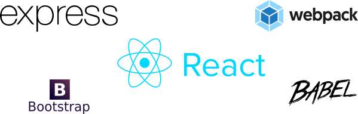

# SandroTchikovani.com

Portfolio Website of Sandro Tchikovani, supporting Server Side Rendering. This project was built with the purpose of learning the technologies below: 



That said, if you come accross this code, feel free to share any feedback, tip, or if you'd just like to chat, you can ping me on Twitter: [@ManOnTheMoon42](https://twitter.com/ManOnTheMoon42).

### Installation

This portfolio requires [Node.js](https://nodejs.org/) v10.15.0+ to run.

Install the dependencies and devDependencies and start the server.

```sh
$ cd sandrotchikovani-ssr-app
$ yarn install
$ yarn dev
```

For production environments...

```sh
$ yarn start
```

License
----

MIT
